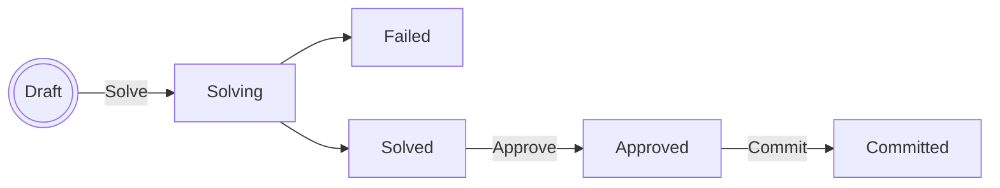

# Autoshift — Shift Optimiser for Frappe HR

Autoshift is a Frappe app that automatically assigns employees to shifts using Mixed Integer Linear Programming (MILP). It integrates with Frappe HR data (employees, shift types, leave applications, holidays) and produces an optimised schedule that maximises room utilisation while respecting staff FTE targets and shift preferences.

Autoshift is organisation-agnostic: disciplines, branches, scheduling roles, room counts and
rules are all records you create in the desk (see [One-time Setup](#one-time-setup)), not
constants in the code. Nothing about any particular practice ships in this repo — if you
are migrating off a legacy system, that is a separate concern (for ZaWin, see the companion
[`zawin2frappe`](https://github.com/CMDBB/zawin2frappe) app).

## Prerequisites

- A Frappe v16 bench. Frappe HR (`hrms`) is a required app and is installed automatically
  with autoshift; Python dependencies (`pulp[cbc]` — ships the COIN-OR CBC solver binary —
  and `numpy`) are installed by bench from `pyproject.toml`.
- Redis (required by Frappe for background jobs)

## Installation

```bash
cd $PATH_TO_YOUR_BENCH
bench get-app $URL_OF_THIS_REPO --branch version-16
bench install-app autoshift
```

Installing seeds the built-in **Optimization Rule** documents and the **Standard Ruleset**
(see below). When updating an already-installed site, run `bench migrate` as usual.

---

## One-time Setup

Before running the optimiser, configure the following three areas in the Frappe desk.

### 1. Optimizer Settings *(singleton)*

**Autoshift → Optimizer Settings**

| Field | Description |
|---|---|
| Bounded Holiday List | Holiday list used for 1-week / 2-week / 4-week planning modes |
| Unbounded Holiday List | Holiday list used for Unbounded planning mode |

### 2. Discipline Branch Config

**Autoshift → Discipline Branch Config** — one record per *(discipline, branch)* combination.

| Field | Description |
|---|---|
| Discipline | Department (e.g. Dental, Hygiene) |
| Branch | Branch / location name |
| Number of Rooms | Number of treatment rooms at this branch for this discipline |
| Shift Types | Which Shift Types the optimiser schedules here; one listed nowhere is excluded as non-clinical |

At least one record is required; the optimiser will throw if none are found.

### 3. Scheduling Roles

**Autoshift → Scheduling Role** — the optimiser's unit of *capability*. A role names exactly
one discipline, and an employee may hold several — which is how somebody who works two
disciplines (say an assistant who also does prophylaxis) is scheduled without either
discipline over-stating its capacity.

| Field | Description |
|---|---|
| Role Name | e.g. "Ortho Assistant" |
| Discipline | The Department this role staffs |
| Max Rooms Per Holder | Rooms one holder covers simultaneously in a single slot |
| Assignments Are Binding | *Optional.* Holders keep exactly the Shift Assignments already on the books — see below |

**Autoshift → Employee Scheduling Role** — one record per employee-capability pair.

| Field | Description |
|---|---|
| Employee | Link to Employee |
| Scheduling Role | The capability they hold |
| Agreed FTE % in Role | *Optional.* The informally agreed share of their time in this role. Blank means no expectation. |
| Max Rooms Override | *Optional.* Overrides the role's figure for this person (e.g. an apprentice covering one chair, not three) |
| Binding Override | *Optional.* Overrides the role's Assignments Are Binding for this person. Blank inherits |
| Valid From / Valid To | *Optional.* Time-boxes a capability acquired or dropped mid-year |

**An employee with no Scheduling Role is not scheduled at all.** This is how non-clinical
staff stay out of scope — `Employee.department` and `Employee.designation` are payroll data
and are not read by the optimiser.

**Assignments Are Binding** is for a role whose schedule is settled by its holders rather
than by the planner — a senior clinician whose week is fixed, say. Their existing Shift
Assignments become an *input*: over the run's horizon they work exactly what is already on
the books, and the optimiser may not add, move or drop any of it. A holder whose schedule
has not settled yet is exempted with **Binding Override = Not Binding** on their Employee
Scheduling Role, and is then scheduled normally alongside everyone else.

Two things still apply to a bound holder. Approved (and speculated) leave wins over a
settled assignment: the colliding shift is dropped rather than making the run infeasible,
and the run-statistics panel reports it so the underlying records can be fixed. And a day
they have nothing on the books stays empty — "settled" means settled, not "fill the gaps".

The toggle only takes effect if the run's ruleset includes the **Bind settled schedules**
rule (it is in the Standard Ruleset). The rule is inert while no role is marked binding, so
it costs nothing on a site that does not use this.

The Agreed FTE % is deliberately soft: the solver is *penalised* for deviating from it
(see the "Agreed role FTE split" objective rule) but never forbidden, because these splits
are normally an informal expectation rather than an entitlement. If you do need it enforced,
add the non-standard **Agreed role FTE ceiling** constraint rule to your ruleset.

### 4. Employee Settings *(optional per employee)*

**Autoshift → Employee Settings** — one record per employee to override defaults.

| Field | Description |
|---|---|
| Employee | Link to Employee |
| Favourite Shift | If set, the optimiser strongly prefers this shift for the employee |
| Shift Preferences | Table of (shift type, weight) pairs; normalised automatically |
| Branch Preferences | Table of preferred branches. *Not yet read by the optimiser — set this field has no effect on a run today.* |

Employees without an Employee Settings record use a uniform shift preference and their `custom_fte` field value (set directly on the Employee doctype) for the FTE target.

### 5. Employee FTE

On each **Employee** record, fill in the **FTE %** field (0–100). This determines the target number of shifts for the planning period. Employees default to 100 % FTE if the field is blank.

### 6. Optimization Rules & Rulesets

The constraints a run enforces — and the objective terms it maximises — are documents, not
hardcoded behaviour.

**Autoshift → Optimization Rule** — one document per rule. Each rule has a natural-language
**Description**, a **Rule Kind** (`Constraint`, `Objective`, or `Mixed`; derived from code
for built-ins, declared by the developer for custom code) and an optional implementation:

| Implementation Type | Meaning |
|---|---|
| `Not Implemented` | The rule exists only as its description — a backlog item for a developer (or an LLM, pending developer validation) to implement later |
| `Built-in` | Points at a rule shipped in the app code via **Built-in Key** (registry in `autoshift/optimizer/rules.py`) |
| `Custom Code` | Python on the document defining `apply(ctx)`; it only runs after a developer checks **Validated by Developer** (editing the code clears the flag) |

The Implementation Code editor assists authoring: autocompletion for the rule API
(`ctx.…`, `ctx.data.…`, `pulp.…`, `itertools.…` — introspected server-side from the real
classes) and inline lint squiggles from [Ruff](https://docs.astral.sh/ruff/) running as
WebAssembly in a browser worker (via [ace-linters](https://github.com/mkslanc/ace-linters);
self-hosted, no external requests). The lint assets come from the app's npm dependencies —
run `yarn install` in `apps/autoshift` followed by `bench build` once per bench (completions
work regardless).

Only implemented rules can be used in a solve. Because writing and validating rules takes
time, rules are bundled into an **Optimization Ruleset** (**Autoshift → Optimization
Ruleset**) — a reusable, ordered list of rules that every Optimizer Run points to. Each
ruleset row carries a **Weight** that multiplies the rule's objective contribution (it has
no effect on constraint rules — saving warns if you set one there).

Migration seeds one Optimization Rule per built-in (constraints: one shift per day, leave
blocklist, existing assignments, max rooms per slot, room coverage, FTE ceiling; objective
terms: room utilization, shift preferences) and a **Standard Ruleset** containing all of
them, which is the default for new runs. Unimplemented rules may sit in a ruleset as a
draft, but a run using that ruleset refuses to solve until they are implemented.

A ruleset with no `Objective`/`Mixed` rule gives the solver nothing to maximise — it
returns an arbitrary feasible schedule (typically nobody assigned). Saving such a ruleset
warns but is allowed, since it's useful for pure feasibility checks. **Note for rulesets
created before objective rules existed:** only the Standard Ruleset is upgraded
automatically; add the objective rules to your own rulesets yourself.

> **Security note:** Custom Code rules execute as ordinary Python at solve time, so
> implementing and validating rules is developer-only. **HR Manager** can create and edit
> rules, but only the name and NL description: the implementation fields (Implementation
> Type, Built-in Key, Implementation Code, Validated by Developer) are read-only for
> everyone except **System Manager** (field permission level 1). The server enforces this
> independently of the UI — a non-developer's attempted implementation change is cleaned
> up with a warning (new rules are forced to `Not Implemented`), and setting *Validated by
> Developer* is refused outright.

---

## Running the Optimiser

### Step 1 — Create an Optimizer Run

**Autoshift → Optimizer Run → New**

| Field | Description |
|---|---|
| Planning Mode | `1-week`, `2-week`, `4-week`, or `Unbounded` |
| Start Date | First Monday of the planning period (any day for Unbounded) |
| Optimization Ruleset | Which rules constrain this run; defaults to **Standard Ruleset** (all built-in rules) |
| Pending Leaves to Treat as Approved | Optional: select pending Leave Applications to block as if approved |

Save the document. Status is **Draft**.

How existing Shift Assignments are treated is no longer a run field — it's a choice of
which rules the run's Ruleset includes: `Honor existing Shift Assignments` fixes them as
hard constraints, `Objective: Conserve Existing Assignments` treats them as a soft
warm-start the solver may override, and including neither disregards them.

> **Not yet usable:** `Unbounded` planning mode is selectable in the UI but raises
> `NotImplementedError` when you try to solve — only `1-week`/`2-week`/`4-week` are
> implemented today.

### Step 2 — Solve

Click **Solve**. There's only one button: the optimiser first attempts to solve synchronously within a short time limit (a few seconds) — for normal practice sizes this finishes immediately and the form reloads with the result.

If CBC doesn't reach a conclusive result within that short window, Autoshift automatically re-queues the same problem as a background job with the full timeout, and the page polls every 5 seconds until it finishes. No separate "background" action is needed.

Status becomes **Solved** on success or **Failed** if no feasible schedule exists.

### Step 3 — Review the Solution

The **Schedule View** tab carries four ways of reading the run, and is up in every state —
including a Draft you have not solved yet and a run that failed.

| Pane | What it answers |
|---|---|
| **Week** | *Is the practice covered?* A one-week wall chart: treatment rooms down the page, days across. Always available. |
| **Statistics** | *Is the schedule full, and if not, why?* Coverage meters, FTE gaps, each rule's share of the objective. |
| **Roster** | *What did this person get?* The per-employee grid, with existing assignments and leave alongside. |
| **Solver Log** | CBC's raw output, for diagnosing infeasibility. Available on a failed run too. |

The **Week** chart is built entirely from your configuration: one band per *(branch,
discipline)* from **Discipline Branch Config**, as many numbered rows as it has rooms, and
one column per **Scheduling Role** of that discipline. So an unstaffed room is a blank row
and a role nobody covers is a blank column — you can see a gap without reading a number.
Use ◀ ▶ to move between weeks.

Before the run is solved the chart shows the **Shift Assignments already on the books**.
Once it is solved, each cell says what the run did with that half-day:

| | |
|---|---|
| **Kept** | already on the books, and the run scheduled it again |
| **Added** | proposed by the run; nothing on the books for it |
| **Dropped** | on the books, and the run did **not** schedule it |
| → | kept, but moved — hover for what changed |
| ★ | pinned rather than chosen (a binding role, or an existing assignment being honoured) |

Anyone the chart cannot place — a role with no Discipline Branch Config, a branch with no
config, a Shift Type the config omits — appears under **Unplaced** with the reason stated
above the chart, so nobody is ever quietly missing. People on leave that week are listed
under the chart: usually the answer to why a room is empty.

The **Assigned Slots** table on the first tab remains the raw record: employee, shift type,
date, branch, and whether the slot was forced. The **Objective Value** is the raw MILP
score (higher is better).

### Step 4 — Approve

Click **Approve**. This locks the solution. Status becomes **Approved**.

### Step 5 — Commit

Click **Commit**. Autoshift creates and submits one **Shift Assignment** record per slot. Status becomes **Committed**.

> **Currently not functional:** how a committed run stays linked to the Shift Assignments it
> creates is being redesigned ([#5](https://github.com/CMDBB/autoshift/issues/5)), and until
> that lands Commit raises `NotImplementedError` — the run stays **Approved** and no records
> are created.

---

## Status Lifecycle



| Status | Meaning |
|---|---|
| Draft | Ready to solve |
| Solving | Solver is running |
| Solved | Optimal solution found; awaiting review |
| Failed | Solver found no feasible solution, or an error occurred |
| Approved | Solution locked by user |
| Committed | Shift Assignments created |

---

## Re-running, Restarting, and Stopping a Run

Optimizer Runs are **immutable** once solving starts: there is no in-place reset, cancel, or re-solve of the same document. Instead, every form (except Draft) shows **Re-run (New Copy)**, which creates a brand-new Draft run with the same Planning Mode, Start Date, Optimization Ruleset, and Leave Speculations, and takes you to it. The original run is left exactly as it was — a permanent record of what was tried and what happened.

This single action covers every case:
- **Re-run a Failed run** — diagnose via the Solver Log, then duplicate and click Solve again.
- **Get a fresh solution for a Solved/Approved/Committed run** — duplicate, optionally tweak the new Draft's settings, then solve.
- **"Stop" a stuck Solving run** — just duplicate and move on with the new run; the original keeps running in the background and will eventually settle into Solved or Failed on its own, but you don't need to wait for it.

The new run is created with **Type = Copy**, distinguishing it from a manually created run (**Manual**) or one created by a future automated tool (**Automatic**). Copy and Manual runs both show up in the Optimizer Run list and workspace by default; **Automatic** runs are hidden from both by default (the type filter can be cleared to see them).

### Detecting identical inputs

Clicking **Solve** first fingerprints the run's input (employees, leaves, FTE targets, preferences, the resolved ruleset, etc.) and checks whether another run already solved that exact same input. If a match is found, you get an **"Identical run detected"** prompt linking to the existing run, but you can press `yes` to re-run anyway.

The Input Hash is only ever recorded on a run that actually went through a real solve attempt, which is also how matches are found for *future* runs.

---

## How the Optimiser Works

The MILP model is built with [PuLP](https://coin-or.github.io/pulp/) and solved by the embedded COIN-OR CBC binary.

**Decision variables**
- `x[employee, role, shift, day, branch]` ∈ {0, 1} — whether an employee works a shift on a day
  at a branch, *in one of their Scheduling Roles*. Variables exist only for roles the employee
  actually holds, so eligibility is structural rather than a constraint — there is nothing to
  forbid, because there is nothing to set.
- `active_rooms[discipline, shift, day, branch]` ∈ ℤ≥0 — rooms staffed in each slot

**Constraints** — supplied by the run's Optimization Ruleset (see [One-time Setup §6](#6-optimization-rules--rulesets)),
one Optimization Rule document per constraint group. The built-in constraint rules:

1. At most one shift per employee per day, summed across every role they hold — a second
   role widens *where* somebody can work, never *how much*
2. Approved and speculated leaves block assignments
3. Existing Shift Assignments honored per the ruleset's choice of rules: fixed
   (`Honor existing Shift Assignments`), soft warm-start
   (`Objective: Conserve Existing Assignments`), or disregarded (neither rule included)
3b. `Bind settled schedules`: holders of a Scheduling Role marked *Assignments Are Binding*
   are frozen at their existing assignments — those fixed on, every other variable of theirs
   fixed off. Orthogonal to the choice in 3 (it is scoped by role, not a fourth global
   policy), so it composes with either member of that choice
4. Max rooms per (employee, role) per slot (from Scheduling Role, optionally overridden per
   Employee Scheduling Role)
5. Room coverage: the roles assigned in a discipline must support its number of active rooms
6. FTE ceiling: assigned shifts ≤ (1 + tolerance) × target, for every employee. This is an
   upper bound only. Staying near the target today comes from the objective's preference term
   pulling assignments up, not from a hard minimum.
7. *(non-standard, opt-in)* Agreed role FTE ceiling: the hard reading of an agreed split —
   a role's shifts ≤ (1 + tolerance) × its agreed figure

**Objective (maximise)** — also supplied by the ruleset; each objective rule's term is
scaled by its row weight. The built-in objective rules:

- Room utilisation: `weight × Σ active_rooms`
- Shift preferences: `weight × Σ pref[employee, shift] × x[...]`
- Agreed role FTE split: `−weight × Σ |assigned[employee, role] − agreed[employee, role]|`,
  linearised with a pair of non-negative slack variables per pair. Only pairs whose Employee
  Scheduling Role names an agreed figure contribute.

Validated Custom Code rules can add further constraints and/or objective terms
(`ctx.add_objective(expr)`) on top of — or instead of — the built-ins.

---

## Limitations & Out of Scope

Current modelling limitations (revisit if the underlying assumption stops holding):

- **No AM/PM fairness term.** The objective only optimises room utilisation and shift
  preference; nothing currently balances how AM vs. PM shifts are distributed across
  employees.
- **Room counts are static for the whole planning period.** Discipline Branch
  Config doesn't support rooms going offline for part of a run (e.g. maintenance, partial
  closures).
- **Leave Application is the only day-level blocker.** There's no modelling for on-call
  duty or other external commitments that should also block a slot.
- **No specific-room assignment.** `Shift Location` exists on `Optimizer Run Slot` as
  scaffolding, but the model only tracks an aggregate room *count* per discipline/slot/branch
  — it doesn't pick which physical room an employee works in.
- **No minimum rest gap between shifts.** Moot today since each employee gets at most one
  shift per day; would need revisiting if night shifts or extended hours are introduced.
- **Rule weights are per-ruleset, not per-run.** Reweighting objective terms for a single
  run means duplicating the ruleset.

Out of scope for this app — handled elsewhere in the Frappe HR / ERPNext stack:

- Payroll calculation (ERPNext salary structures)
- Revenue/turnover tracking per doctor per shift (ERPNext Healthcare or Invoicing)
- Patient appointment scheduling (separate system)
- Real-time attendance tracking (Frappe HR check-ins)

---

## Development

Python tooling runs through [uv](https://docs.astral.sh/uv/) using the app's `pyproject.toml`
dev dependency group (`uv sync` once to create `.venv`).

### Unit tests (pure Python, no site needed)

The optimizer engine (`autoshift/optimizer/`, minus `data_loader`) has no Frappe imports and
is covered by a fast pytest suite: planning-day generation, input hashing, every built-in
rule, rule selection, custom-code rules, and multi-employee integration scenarios.

```bash
cd apps/autoshift
uv run pytest tests/
```

### Integration tests (need a Frappe site)

Doctype-level tests (solve lifecycle and caching, the developer-only rule
implementation/validation gate) run with bench, the same way CI does. Run them only against
a **disposable, never-served test site** — never against a site whose state you care about.
They must pass on a freshly created site; if a test needs records, seed them in the test
itself rather than relying on site state (and prune Frappe's recursive test-record
generation with `IGNORE_TEST_RECORD_DEPENDENCIES` — see `test_optimizer_run.py`).

```bash
bench new-site dev.test.localhost --db-root-password <pw> --admin-password <pw>
bench --site dev.test.localhost install-app autoshift
bench --site dev.test.localhost set-config allow_tests true

# full suite, as CI runs it:
bench --site dev.test.localhost run-tests --app autoshift
# or a single module:
bench --site dev.test.localhost run-tests --module autoshift.autoshift.doctype.optimizer_run.test_optimizer_run
```

Note: creating a new site can steal `default_site` in `common_site_config.json` — point it
back at your development site so the test site is never served.

### Linting

```bash
pre-commit install # once
pre-commit # then
```

Configured hooks: **ruff** (lint + format), **eslint**, **prettier**, **pyupgrade** — run on
every commit and by CI on PRs.

CI additionally runs Frappe's Semgrep correctness rules, pinned via the
`frappe-semgrep-rules` git submodule. To reproduce locally, initialise the submodule once,
then scan:

```bash
git submodule update --init frappe-semgrep-rules
uv run semgrep scan --config ./frappe-semgrep-rules/rules --config r/python.lang.correctness
```

### Front-end assets

The app has npm dependencies (`package.json`): `ace-linters` + `ace-python-ruff-linter`
power the in-browser lint of Custom Code rules. `bench setup requirements` (or a manual
`yarn install` in `apps/autoshift`) installs them; `bench build` then symlinks
`node_modules` into served assets (`/assets/autoshift/node_modules/…`), from which
`optimization_rule.js` lazy-loads them only on the Optimization Rule form.

### Adding dev data

`dump-dev-data` / `seed-dev-data` move **Autoshift's own configuration** between sites —
Holiday List, Scheduling Role, Discipline Branch Config, Employee Scheduling Role,
Employee Settings and Optimizer
Settings. They deliberately do *not* cover Company, Branch, Department, Designation, Shift
Type or Employee: those are upstream HR data, and the records these link to must already
exist on the target site before you seed.

```bash
bench --site YOUR_SITE dump-dev-data --output ./dev_data   # snapshot a configured site
bench --site YOUR_SITE seed-dev-data --input ./dev_data    # restore onto another
```

Existing records are left alone unless you pass `--overwrite`. Don't seed dev data into the
test site — keep it pristine.

A dump contains real employees and leave records from whichever site produced it, so
`dev_data/` is gitignored. The same goes for `sandbox/`: `capture-datapackage` snapshots are
gitignored and a pre-commit hook strips `playground.ipynb` outputs, because the notebook runs
against live data. Don't commit around either.

---

## License

GPL-3.0
