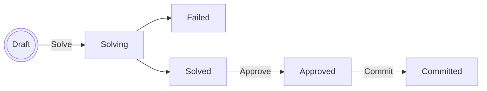

# Autoshift — Shift Optimiser for Frappe HR

Autoshift is a Frappe app that automatically assigns employees to shifts using Mixed Integer Linear Programming (MILP). It integrates with Frappe HR data (employees, shift types, leave applications, holidays) and produces an optimised schedule that maximises room utilisation while respecting staff FTE targets and shift preferences.

## Prerequisites

- A Frappe v16 bench. Frappe HR (`hrms`) is a required app and is installed automatically
  with autoshift; Python dependencies (`pulp[cbc]` — ships the COIN-OR CBC solver binary —
  and `numpy`) are installed by bench from `pyproject.toml`.
- Redis (required by Frappe for background jobs)

## Installation

```bash
cd $PATH_TO_YOUR_BENCH
bench get-app $URL_OF_THIS_REPO --branch version-16
bench install-app autoshift
```

Installing seeds the built-in **Optimization Rule** documents and the **Standard Ruleset**
(see below). When updating an already-installed site, run `bench migrate` as usual.

---

## One-time Setup

Before running the optimiser, configure the following three areas in the Frappe desk.

### 1. Optimizer Settings *(singleton)*

**Autoshift → Optimizer Settings**

| Field | Description |
|---|---|
| Bounded Holiday List | Holiday list used for 1-week / 2-week / 4-week planning modes |
| Unbounded Holiday List | Holiday list used for Unbounded planning mode |
| FTE Tolerance % | Allowed deviation from each employee's FTE target (default 5 %) |
| Turnover Weight | Objective weight placed on maximising active rooms (default 1.0) |

### 2. Discipline Designation Branch Config

**Autoshift → Discipline Designation Branch Config** — one record per *(discipline, designation, branch)* combination.

| Field | Description |
|---|---|
| Discipline | Department (e.g. Dental, Hygiene) |
| Employee Type | Frappe designation that maps to this discipline |
| Branch | Branch / location name |
| Rooms Num | Number of treatment rooms at this branch for this discipline |
| Max Rooms for Employee Type | Maximum rooms one employee of this designation can staff simultaneously |

At least one record is required; the optimiser will throw if none are found.

### 3. Employee Settings *(optional per employee)*

**Autoshift → Employee Settings** — one record per employee to override defaults.

| Field | Description |
|---|---|
| Employee | Link to Employee |
| Favourite Shift | If set, the optimiser strongly prefers this shift for the employee |
| Shift Preferences | Table of (shift type, weight) pairs; normalised automatically |
| Branch Preferences | Table of preferred branches. *Not yet read by the optimiser — set this field has no effect on a run today.* |

Employees without an Employee Settings record use a uniform shift preference and their `custom_fte` field value (set directly on the Employee doctype) for the FTE target.

### 4. Employee FTE

On each **Employee** record, fill in the **FTE %** field (0–100). This determines the target number of shifts for the planning period. Employees default to 100 % FTE if the field is blank.

### 5. Optimization Rules & Rulesets

The constraints a run enforces are documents, not hardcoded behaviour.

**Autoshift → Optimization Rule** — one document per rule. Each rule has a natural-language
**Description** and an optional implementation:

| Implementation Type | Meaning |
|---|---|
| `Not Implemented` | The rule exists only as its description — a backlog item for a developer (or an LLM, pending developer validation) to implement later |
| `Built-in` | Points at a rule shipped in the app code via **Built-in Key** (registry in `autoshift/optimizer/rules.py`) |
| `Custom Code` | Python on the document defining `apply(ctx)`; it only runs after a developer checks **Validated by Developer** (editing the code clears the flag) |

Only implemented rules can be used in a solve. Because writing and validating rules takes
time, rules are bundled into an **Optimization Ruleset** (**Autoshift → Optimization
Ruleset**) — a reusable, ordered list of rules that every Optimizer Run points to.

Migration seeds one Optimization Rule per built-in constraint (one shift per day, leave
blocklist, existing assignments, max rooms per slot, room coverage, FTE ceiling) and a
**Standard Ruleset** containing all of them, which is the default for new runs. Unimplemented
rules may sit in a ruleset as a draft, but a run using that ruleset refuses to solve until
they are implemented.

> **Security note:** Custom Code rules execute as ordinary Python at solve time, so
> implementing and validating rules is developer-only. **HR Manager** can create and edit
> rules, but only the name and NL description: the implementation fields (Implementation
> Type, Built-in Key, Implementation Code, Validated by Developer) are read-only for
> everyone except **System Manager** (field permission level 1). The server enforces this
> independently of the UI — a non-developer's attempted implementation change is cleaned
> up with a warning (new rules are forced to `Not Implemented`), and setting *Validated by
> Developer* is refused outright.

---

## Running the Optimiser

### Step 1 — Create an Optimizer Run

**Autoshift → Optimizer Run → New**

| Field | Description |
|---|---|
| Planning Mode | `1-week`, `2-week`, `4-week`, or `Unbounded` |
| Start Date | First Monday of the planning period (any day for Unbounded) |
| Existing Shift Assignments | `Use` = fix already-submitted assignments; `Ignore` = start fresh; `Weigh` = treat as soft preference |
| Optimization Ruleset | Which rules constrain this run; defaults to **Standard Ruleset** (all built-in rules) |
| Pending Leaves to Treat as Approved | Optional: select pending Leave Applications to block as if approved |

Save the document. Status is **Draft**.

> **Not yet usable:** `Unbounded` planning mode is selectable in the UI but raises
> `NotImplementedError` when you try to solve — only `1-week`/`2-week`/`4-week` are
> implemented today. All three Existing Shift Assignments modes work: `Use` fixes existing
> assignments as hard constraints, `Weigh` uses them as a soft warm-start the solver may
> override, `Ignore` disregards them.

### Step 2 — Solve

Click **Solve**. There's only one button: the optimiser first attempts to solve synchronously within a short time limit (a few seconds) — for normal practice sizes this finishes immediately and the form reloads with the result.

If CBC doesn't reach a conclusive result within that short window, Autoshift automatically re-queues the same problem as a background job with the full timeout, and the page polls every 5 seconds until it finishes. No separate "background" action is needed.

Status becomes **Solved** on success or **Failed** if no feasible schedule exists.

### Step 3 — Review the Solution

The **Assigned Slots** table shows the full schedule: employee, shift type, date, branch, and whether the slot was forced from an existing Shift Assignment. The **Objective Value** shows the raw MILP objective score (higher is better).

Check the **Solver Log** section for CBC solver output if you need to diagnose infeasibility.

### Step 4 — Approve

Click **Approve**. This locks the solution. Status becomes **Approved**.

### Step 5 — Commit

Click **Commit**. Autoshift creates and submits one **Shift Assignment** record per slot. Status becomes **Committed**.

> **Currently not functional:** how a committed run stays linked to the Shift Assignments it
> creates is being redesigned ([#5](https://github.com/CMDBB/autoshift/issues/5)), and until
> that lands Commit raises `NotImplementedError` — the run stays **Approved** and no records
> are created.

---

## Status Lifecycle



| Status | Meaning |
|---|---|
| Draft | Ready to solve |
| Solving | Solver is running |
| Solved | Optimal solution found; awaiting review |
| Failed | Solver found no feasible solution, or an error occurred |
| Approved | Solution locked by user |
| Committed | Shift Assignments created |

---

## Re-running, Restarting, and Stopping a Run

Optimizer Runs are **immutable** once solving starts: there is no in-place reset, cancel, or re-solve of the same document. Instead, every form (except Draft) shows **Re-run (New Copy)**, which creates a brand-new Draft run with the same Planning Mode, Start Date, Existing Shift Assignments setting, and Leave Speculations, and takes you to it. The original run is left exactly as it was — a permanent record of what was tried and what happened.

This single action covers every case:
- **Re-run a Failed run** — diagnose via the Solver Log, then duplicate and click Solve again.
- **Get a fresh solution for a Solved/Approved/Committed run** — duplicate, optionally tweak the new Draft's settings, then solve.
- **"Stop" a stuck Solving run** — just duplicate and move on with the new run; the original keeps running in the background and will eventually settle into Solved or Failed on its own, but you don't need to wait for it.

The new run is created with **Type = Copy**, distinguishing it from a manually created run (**Manual**) or one created by a future automated tool (**Automatic**). Copy and Manual runs both show up in the Optimizer Run list and workspace by default; **Automatic** runs are hidden from both by default (the type filter can be cleared to see them).

### Detecting identical inputs

Clicking **Solve** first fingerprints the run's input (employees, leaves, FTE targets, preferences, the resolved ruleset, etc.) and checks whether another run already solved that exact same input. If a match is found, you get an **"Identical run detected"** prompt linking to the existing run, but you can press `yes` to re-run anyway.

The Input Hash is only ever recorded on a run that actually went through a real solve attempt, which is also how matches are found for *future* runs.

---

## How the Optimiser Works

The MILP model is built with [PuLP](https://coin-or.github.io/pulp/) and solved by the embedded COIN-OR CBC binary.

**Decision variables**
- `x[employee, shift, day, branch]` ∈ {0, 1} — whether an employee is assigned to a shift on a day at a branch
- `active_rooms[discipline, shift, day, branch]` ∈ ℤ≥0 — rooms staffed in each slot

**Constraints** — supplied by the run's Optimization Ruleset (see [One-time Setup §5](#5-optimization-rules--rulesets)),
one Optimization Rule document per constraint group. The built-in rules:

1. At most one shift per employee per day
2. Approved and speculated leaves block assignments
3. Existing Shift Assignments honored per the run's mode: fixed (`Use`), soft warm-start
   (`Weigh`), or disregarded (`Ignore`)
4. Max rooms per employee per slot (from Discipline Designation Branch Config)
5. Room coverage: staff headcount must support the number of active rooms
6. FTE ceiling: assigned shifts ≤ (1 + tolerance) × target, for every employee. This is an
   upper bound only. Staying near the target today comes from the objective's preference term
   pulling assignments up, not from a hard minimum.

Validated Custom Code rules add further constraints on top of (or instead of) these.

**Objective (maximise)**
- Room utilisation: `turnover_weight × Σ active_rooms`
- Shift preferences: `Σ pref[employee, shift] × x[employee, shift, day, branch]`

---

## Limitations & Out of Scope

Current modelling limitations (revisit if the underlying assumption stops holding):

- **No AM/PM fairness term.** The objective only optimises room utilisation and shift
  preference; nothing currently balances how AM vs. PM shifts are distributed across
  employees.
- **Room counts are static for the whole planning period.** Discipline Designation Branch
  Config doesn't support rooms going offline for part of a run (e.g. maintenance, partial
  closures).
- **Leave Application is the only day-level blocker.** There's no modelling for on-call
  duty or other external commitments that should also block a slot.
- **No specific-room assignment.** `Shift Location` exists on `Optimizer Run Slot` as
  scaffolding, but the model only tracks an aggregate room *count* per discipline/slot/branch
  — it doesn't pick which physical room an employee works in.
- **No minimum rest gap between shifts.** Moot today since each employee gets at most one
  shift per day; would need revisiting if night shifts or extended hours are introduced.
- **Rules control constraints only.** The objective (room utilisation + shift preferences)
  is still hardcoded in the model builder; Custom Code rules cannot add or reweight
  objective terms.

Out of scope for this app — handled elsewhere in the Frappe HR / ERPNext stack:

- Payroll calculation (ERPNext salary structures)
- Revenue/turnover tracking per doctor per shift (ERPNext Healthcare or Invoicing)
- Patient appointment scheduling (separate system)
- Real-time attendance tracking (Frappe HR check-ins)

---

## Development

Python tooling runs through [uv](https://docs.astral.sh/uv/) using the app's `pyproject.toml`
dev dependency group (`uv sync` once to create `.venv`).

### Unit tests (pure Python, no site needed)

The optimizer engine (`autoshift/optimizer/`, minus `data_loader`) has no Frappe imports and
is covered by a fast pytest suite: planning-day generation, input hashing, every built-in
rule, rule selection, custom-code rules, and multi-employee integration scenarios.

```bash
cd apps/autoshift
uv run pytest tests/
```

### Integration tests (need a Frappe site)

Doctype-level tests (solve lifecycle and caching, the developer-only rule
implementation/validation gate) run with bench, the same way CI does. Run them only against
a **disposable, never-served test site** — never against a site whose state you care about.
They must pass on a freshly created site; if a test needs records, seed them in the test
itself rather than relying on site state (and prune Frappe's recursive test-record
generation with `IGNORE_TEST_RECORD_DEPENDENCIES` — see `test_optimizer_run.py`).

```bash
bench new-site dev.test.localhost --db-root-password <pw> --admin-password <pw>
bench --site dev.test.localhost install-app autoshift
bench --site dev.test.localhost set-config allow_tests true

# full suite, as CI runs it:
bench --site dev.test.localhost run-tests --app autoshift
# or a single module:
bench --site dev.test.localhost run-tests --module autoshift.autoshift.doctype.optimizer_run.test_optimizer_run
```

Note: creating a new site can steal `default_site` in `common_site_config.json` — point it
back at your development site so the test site is never served.

### Linting

```bash
pre-commit install # once
pre-commit # then
```

Configured hooks: **ruff** (lint + format), **eslint**, **prettier**, **pyupgrade** — run on
every commit and by CI on PRs.

CI additionally runs Frappe's Semgrep correctness rules, pinned via the
`frappe-semgrep-rules` git submodule. To reproduce locally, initialise the submodule once,
then scan:

```bash
git submodule update --init frappe-semgrep-rules
uv run semgrep scan --config ./frappe-semgrep-rules/rules --config r/python.lang.correctness
```

### Adding dev data

```bash
bench --site YOUR_SITE seed-dev-data --input ./dev_data
```

(`dump-dev-data` is the inverse, for snapshotting an existing site's data.) Don't seed dev
data into the test site — keep it pristine.

---

## License

GPL-3.0
