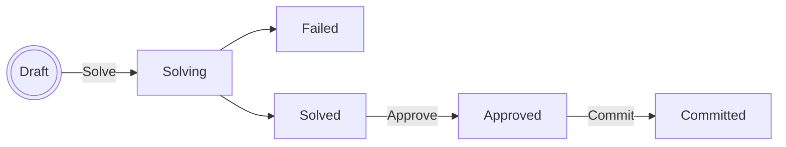

# Autoshift — Shift Optimiser for Frappe HR

Autoshift is a Frappe app that automatically assigns employees to shifts using Mixed Integer Linear Programming (MILP). It integrates with Frappe HR data (employees, shift types, leave applications, holidays) and produces an optimised schedule that maximises room utilisation while respecting staff FTE targets and shift preferences.

## Prerequisites

- Frappe v16 with Frappe HR installed
- PuLP Python package (`pip install pulp[cbc]`) — ships with the COIN-OR CBC solver binary
- Redis (required by Frappe for background jobs)

## Installation

```bash
cd $PATH_TO_YOUR_BENCH
bench get-app $URL_OF_THIS_REPO --branch version-16
bench install-app autoshift
bench migrate
```

---

## One-time Setup

Before running the optimiser, configure the following three areas in the Frappe desk.

### 1. Optimizer Settings *(singleton)*

**Autoshift → Optimizer Settings**

| Field | Description |
|---|---|
| Bounded Holiday List | Holiday list used for 1-week / 2-week / 4-week planning modes |
| Unbounded Holiday List | Holiday list used for Unbounded planning mode |
| FTE Tolerance % | Allowed deviation from each employee's FTE target (default 5 %) |
| Turnover Weight | Objective weight placed on maximising active rooms (default 1.0) |

### 2. Discipline Designation Branch Config

**Autoshift → Discipline Designation Branch Config** — one record per *(discipline, designation, branch)* combination.

| Field | Description |
|---|---|
| Discipline | Department (e.g. Dental, Hygiene) |
| Employee Type | Frappe designation that maps to this discipline |
| Branch | Branch / location name |
| Rooms Num | Number of treatment rooms at this branch for this discipline |
| Max Rooms for Employee Type | Maximum rooms one employee of this designation can staff simultaneously |

At least one record is required; the optimiser will throw if none are found.

### 3. Employee Settings *(optional per employee)*

**Autoshift → Employee Settings** — one record per employee to override defaults.

| Field | Description |
|---|---|
| Employee | Link to Employee |
| Favourite Shift | If set, the optimiser strongly prefers this shift for the employee |
| Shift Preferences | Table of (shift type, weight) pairs; normalised automatically |
| Branch Preferences | Table of preferred branches. *Not yet read by the optimiser — set this field has no effect on a run today.* |

Employees without an Employee Settings record use a uniform shift preference and their `custom_fte` field value (set directly on the Employee doctype) for the FTE target.

### 4. Employee FTE

On each **Employee** record, fill in the **FTE %** field (0–100). This determines the target number of shifts for the planning period. Employees default to 100 % FTE if the field is blank.

---

## Running the Optimiser

### Step 1 — Create an Optimizer Run

**Autoshift → Optimizer Run → New**

| Field | Description |
|---|---|
| Planning Mode | `1-week`, `2-week`, `4-week`, or `Unbounded` |
| Start Date | First Monday of the planning period (any day for Unbounded) |
| Existing Shift Assignments | `Use` = fix already-submitted assignments; `Ignore` = start fresh; `Weigh` = treat as soft preference |
| Pending Leaves to Treat as Approved | Optional: select pending Leave Applications to block as if approved |

Save the document. Status is **Draft**.

> **Not yet usable:** `Unbounded` planning mode and the `Use`/`Weigh` settings for Existing
> Shift Assignments are selectable in the UI but raise `NotImplementedError` when you try to
> solve — only `1-week`/`2-week`/`4-week` modes and `Ignore` are implemented today.

### Step 2 — Solve

Click **Solve**. There's only one button: the optimiser first attempts to solve synchronously within a short time limit (a few seconds) — for normal practice sizes this finishes immediately and the form reloads with the result.

If CBC doesn't reach a conclusive result within that short window, Autoshift automatically re-queues the same problem as a background job with the full timeout, and the page polls every 5 seconds until it finishes. No separate "background" action is needed.

Status becomes **Solved** on success or **Failed** if no feasible schedule exists.

### Step 3 — Review the Solution

The **Assigned Slots** table shows the full schedule: employee, shift type, date, branch, and whether the slot was forced from an existing Shift Assignment. The **Objective Value** shows the raw MILP objective score (higher is better).

Check the **Solver Log** section for CBC solver output if you need to diagnose infeasibility.

### Step 4 — Approve

Click **Approve**. This locks the solution. Status becomes **Approved**.

### Step 5 — Commit

Click **Commit**. Autoshift creates and submits one **Shift Assignment** record per slot. Status becomes **Committed**.

---

## Status Lifecycle



| Status | Meaning |
|---|---|
| Draft | Ready to solve |
| Solving | Solver is running |
| Solved | Optimal solution found; awaiting review |
| Failed | Solver found no feasible solution, or an error occurred |
| Approved | Solution locked by user |
| Committed | Shift Assignments created |

---

## Re-running, Restarting, and Stopping a Run

Optimizer Runs are **immutable** once solving starts: there is no in-place reset, cancel, or re-solve of the same document. Instead, every form (except Draft) shows **Re-run (New Copy)**, which creates a brand-new Draft run with the same Planning Mode, Start Date, Existing Shift Assignments setting, and Leave Speculations, and takes you to it. The original run is left exactly as it was — a permanent record of what was tried and what happened.

This single action covers every case:
- **Re-run a Failed run** — diagnose via the Solver Log, then duplicate and click Solve again.
- **Get a fresh solution for a Solved/Approved/Committed run** — duplicate, optionally tweak the new Draft's settings, then solve.
- **"Stop" a stuck Solving run** — just duplicate and move on with the new run; the original keeps running in the background and will eventually settle into Solved or Failed on its own, but you don't need to wait for it.

The new run is created with **Type = Copy**, distinguishing it from a manually created run (**Manual**) or one created by a future automated tool (**Automatic**). Copy and Manual runs both show up in the Optimizer Run list and workspace by default; **Automatic** runs are hidden from both by default (the type filter can be cleared to see them).

### Detecting identical inputs

Clicking **Solve** first fingerprints the run's input (employees, leaves, FTE targets, preferences, etc.) and checks whether another run already solved that exact same input. If a match is found, nothing is solved: you get an **"Identical run detected"** prompt linking to the existing run, and this Draft is left completely untouched — including its **Input Hash**, which stays unset. That matters because the hash can only be known once you actually attempt to solve, and a Draft you don't solve right now might see different underlying data (a new leave application, a changed FTE, etc.) the next time you do try — so it must stay re-solvable rather than being silently filled in with someone else's result.

The Input Hash is only ever recorded on a run that actually went through a real solve attempt, which is also how matches are found for *future* runs.

---

## How the Optimiser Works

The MILP model is built with [PuLP](https://coin-or.github.io/pulp/) and solved by the embedded COIN-OR CBC binary.

**Decision variables**
- `x[employee, shift, day, branch]` ∈ {0, 1} — whether an employee is assigned to a shift on a day at a branch
- `active_rooms[discipline, shift, day, branch]` ∈ ℤ≥0 — rooms staffed in each slot

**Constraints**
1. At most one shift per employee per day
2. Approved and speculated leaves block assignments
3. Forced assignments — code path exists for `Use` mode but is not yet wired in (raises
   `NotImplementedError`); only `Ignore` works today
4. Max rooms per employee per slot (from Discipline Designation Branch Config)
5. Room coverage: staff headcount must support the number of active rooms
6. FTE target: assigned shifts ≤ (1 + tolerance) × target, for every employee. This is an
   upper bound only — there's currently no lower bound, and no distinction between salaried
   and turnover-paid staff (that split is planned but not implemented; see `is_salaried` in
   CLAUDE.md). Staying near the target today comes from the objective's preference term
   pulling assignments up, not from a hard minimum.

**Objective (maximise)**
- Room utilisation: `turnover_weight × Σ active_rooms`
- Shift preferences: `Σ pref[employee, shift] × x[employee, shift, day, branch]`

---

## Limitations & Out of Scope

Current modelling limitations (revisit if the underlying assumption stops holding):

- **No AM/PM fairness term.** The objective only optimises room utilisation and shift
  preference; nothing currently balances how AM vs. PM shifts are distributed across
  employees.
- **Room counts are static for the whole planning period.** Discipline Designation Branch
  Config doesn't support rooms going offline for part of a run (e.g. maintenance, partial
  closures).
- **Leave Application is the only day-level blocker.** There's no modelling for on-call
  duty or other external commitments that should also block a slot.
- **No specific-room assignment.** `Shift Location` exists on `Optimizer Run Slot` as
  scaffolding, but the model only tracks an aggregate room *count* per discipline/slot/branch
  — it doesn't pick which physical room an employee works in.
- **No minimum rest gap between shifts.** Moot today since each employee gets at most one
  shift per day; would need revisiting if night shifts or extended hours are introduced.

Out of scope for this app — handled elsewhere in the Frappe HR / ERPNext stack:

- Payroll calculation (ERPNext salary structures)
- Revenue/turnover tracking per doctor per shift (ERPNext Healthcare or Invoicing)
- Patient appointment scheduling (separate system)
- Real-time attendance tracking (Frappe HR check-ins)

---

## Development

### Running tests

```bash
cd apps/autoshift
python -m pytest tests/ -v
```

Tests are pure Python (no Frappe context required) and cover planning-day generation, leave blocking, forced assignments, FTE constraints, and multi-employee integration.

### Pre-commit hooks

```bash
pre-commit install
```

Configured hooks: **ruff** (lint + format), **eslint**, **prettier**, **pyupgrade**.

### Adding dev data

```bash
bench --site YOUR_SITE seed-dev-data --input ./dev_data
```

(`dump-dev-data` is the inverse, for snapshotting an existing site's data.)

---

## License

GPL-3.0
